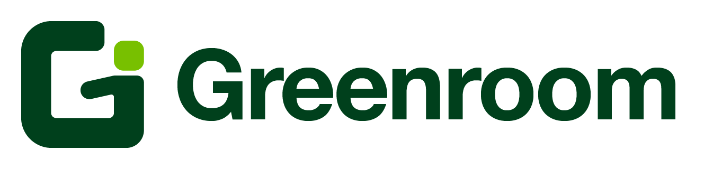
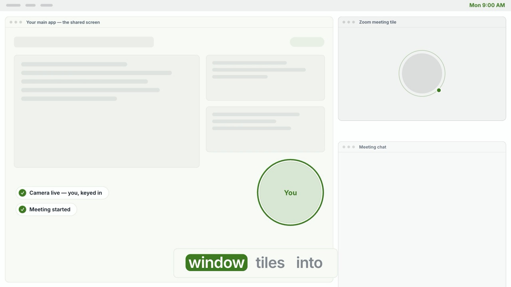

<p align="center">
  
</p>

<p align="center">
  <a href="https://sibhimanyu.github.io/greenroom/#video"></a>
  <br>
  <a href="https://sibhimanyu.github.io/greenroom/#video"><b>&#9654;&#65039; Watch the 37-second intro</b></a>
</p>

# Greenroom

One click sets up your whole morning-meeting workspace:

- **OBS virtual camera** publishing your screen with your webcam keyed into
  a bubble (or green-screen cutout) in the corner — pick "OBS Virtual
  Camera" in Zoom and whoever you're talking to sees your screen with you
  in it.
- **The Zoom meeting**, either created fresh under your account (you host)
  or joined by ID/link — by default through Greenroom's own built-in
  Meeting SDK client, no separate Zoom app window.
- **A tiled layout**: your main working app (Chrome by default — any app
  works) on one side of the screen, with the Zoom meeting tile stacked
  over a standalone chat window in the remaining column.

Press **Stop** and it all tears down cleanly.

---

## Installing (from a GitHub release)

1. Grab `Greenroom-x.y.z.zip` from
   [Releases](https://github.com/Sibhimanyu/greenroom/releases) and
   double-click to unzip.
2. **Drag `Greenroom.app` into `/Applications` before launching it.**
   (Launching a freshly downloaded app from `~/Downloads` can trigger
   macOS "app translocation" — a randomized read-only mount that makes the
   first session behave oddly. Moving it first avoids that.)
3. First launch — the app is signed with a development certificate but
   **not notarized**, so macOS blocks the first open:
   - **macOS 15 (Sequoia) and later:** open it once (it gets blocked),
     then System Settings → **Privacy & Security** → scroll down →
     **"Open Anyway"** → confirm. The right-click trick no longer works
     on Sequoia.
   - **macOS 14 and earlier:** right-click the app → **Open** → confirm.

   Either way it's a one-time decision; every later launch is a normal
   double-click.

**Why a `.zip` and not a `.dmg`?** Building a DMG mounts a temporary
volume, and corporate endpoint security (CrowdStrike's data-protection
module, on the machine these releases are built on) treats mounted disk
images like removable media and blocks the unmount — DMG creation dies
mid-pipeline. A `ditto`-made zip is plain file I/O, preserves the code
signature (verified after a round-trip on every release), and unzips to
the same drag-to-Applications experience.

### Requirements

- macOS 14 or later
- [OBS Studio](https://obsproject.com) (free) — Greenroom launches and
  drives it in the background; you never touch the OBS UI
- The Zoom desktop app — only for the classic/hybrid flow; the default
  built-in meeting client doesn't need it

---

## First-run setup

First launch opens a built-in **setup guide** that walks through all of
this interactively, with live detection of what's already done. Reopen it
anytime from the **?** button in the main window. The short version:

1. **Install OBS** (link above). Nothing to configure in it — Greenroom
   creates and manages its own scene.
2. **Get the Zoom credentials in.** Two paths:
   - **Someone already set this up** (a teammate sent you the app): have
     them export their settings — Settings (⌘,) → **Transfer** →
     *Export Settings…* — and send you the file. Import it in the same
     tab. Done; skip step 3 knowledge entirely. The file carries the
     credentials in **plaintext by design** (it's meant for direct
     hand-off between trusted people, e.g. AirDrop) — delete it after
     importing.
   - **You're setting up from scratch:** you need two free Zoom
     Marketplace apps (one for the chat/meeting client, one for creating
     meetings). Step-by-step instructions live in
     [`Vendor/README.md`](Vendor/README.md).
3. **Grant permissions as macOS asks for them** (the guide tracks each):

   | Permission | When it's asked | What it's for |
   |---|---|---|
   | Camera | First Start | The webcam feed OBS composites |
   | Automation → Google Chrome | First time the Chrome window is tiled | Chrome is positioned via its own AppleScript dictionary |
   | Accessibility | First time a Zoom/native window is tiled | Moving windows of apps that have no AppleScript dictionary — the native Zoom meeting window, and any non-Chrome main app |

   Screen Recording permission belongs to **OBS**, not Greenroom — OBS
   asks for it itself the first time it captures your display.

   **Credential storage note:** the Zoom app credentials are kept in
   Greenroom's local preferences (`UserDefaults`) in **plain text** — not
   encrypted (see `App/Zoom/SecretStore.swift`). Greenroom does not use
   the macOS Keychain at all. They never leave your Mac except to Zoom
   itself; the risk is purely local (someone with access to your user
   account could read them).
   See the [how-it-works / safety page](https://sibhimanyu.github.io/greenroom/how-it-works.html).

---

## Daily use

1. Pick **New Meeting** (creates a fresh meeting under your Zoom account,
   you host) or **Join Existing** (paste a link with the **Paste Link**
   button, or type the meeting ID/passcode).
2. Press **Start**. In order: OBS launches hidden and the virtual camera
   goes live → the meeting starts/joins → your main app opens tiled to
   its slice → the Zoom tile and chat window fill the side column →
   Greenroom's own window drops to the back and your main app is focused.
3. Work. The chat window is a real chat client for the meeting — no need
   to open Zoom's chat panel over your shared screen.
4. Press **Stop** (main window or menu bar): leaves/ends the meeting,
   closes the chat, stops the virtual camera, quits OBS.

Also available:

- **Record** (main window or menu bar) — records exactly what the virtual
  camera is sending (screen + webcam composite, not other participants).
  The file path is logged when you stop.
- **Menu bar → Snap Windows Back** — re-tiles everything to the session
  layout after you've dragged windows around.
- **Manual controls** (disclosure in the main window) — each piece of the
  session individually: open just the chat window, just the main-app
  window, or just Zoom.

---

## Settings (⌘,)

### Webcam
How you appear in the composite: **square**, **circle**, **rounded
rectangle**, **cutout**, or **presenter**. Cutout chroma-keys your
background away so you float over the shared screen; Presenter rebuilds
the macOS "Presenter Overlay (Large)" look inside the composite — the
shared screen shrinks into a rounded panel and you stand keyed at full
height in front of it. (Apple's own Presenter Overlay can't be triggered
programmatically and is Apple-silicon-only; this one works on any Mac and
needs no per-meeting toggle.) Both keyed modes need a real green screen
behind you; tune the key in OBS → webcam source → Filters if edges look
rough. Shape changes apply on the next Start.

### Layout
The tiled-workspace arrangement, with a live schematic that previews
every change:

- **Main app** — dropdown of every installed and running app, with
  **Greenroom Browser** pinned at the top. Chrome is the default. If the
  chosen app is a browser (anything registered as an `https` handler), an
  **Open website** field appears — that URL opens in the tiled window on
  Start.
  - *Greenroom Browser* is the app's own WebKit window: tabs, back /
    forward / reload, find in page (⌘F), history (⌘Y, kept locally in
    `~/Library/Application Support/Greenroom/browser-history.json`), an
    address bar that also searches and suggests as you type (history
    locally; Google completions only while **Suggest searches as you
    type** is on — that setting is the one request the browser makes on
    its own account), the usual shortcuts (⌘T, ⌘W, ⌘L, ⌘R,
    ⌘[ / ⌘], ⌘⌥←/→ or ⌃Tab between tabs, ⌘1–9, ⌘+/−/0), downloads to
    ~/Downloads — tiled by Greenroom directly with no Accessibility or
    Automation permission. Sign-ins persist between sessions, and
    **Reopen last session's tabs on Start** (on by default) brings back
    the tabs from the last run alongside the configured website. **Close
    the browser window when the session ends** (off by default) makes Stop
    close it too — tabs are kept for the next Start. Pick
    Chrome (or any other browser) instead when you need extensions.
- **Main pane width** — ½, ⅔, or ¾ of the screen — and which **side** it
  sits on. The side column is whatever's left.
- **Side column** — toggles for the **Zoom meeting tile** and the **chat
  window**, plus a slider for how much of the column's height the Zoom
  tile takes (the chat gets the rest; a lone occupant takes the whole
  column). Toggle one off and it simply isn't tiled — the window stays
  wherever it is.
- **Open the main app automatically on Start** — the opt-out for the
  one-button flow.

A yellow inline warning appears if you pick a non-Chrome app before
granting Accessibility permission — Chrome is special-cased through its
own AppleScript dictionary (lighter per-app Automation permission), but
every other app can only be moved via the Accessibility API. The warning
has an *Open Settings…* button and clears itself once you flip the
switch.

### Meeting Chat
Client ID + Secret of the Meeting SDK Marketplace app (General App →
Features → Embed → Meeting SDK). Powers the built-in meeting client and
the chat window. **Only works in meetings hosted under the same Zoom
account as these credentials** — see limitations below.

### Start Meeting
Account ID / Client ID / Secret of the Server-to-Server OAuth Marketplace
app — powers "New Meeting". Also here:

- **Use built-in meeting client** (default ON): the whole meeting runs
  inside Greenroom — you appear once, camera/mic live, hosting directly.
  OFF falls back to the hybrid flow: the native Zoom app plus a hidden
  "Greenroom Chat" participant carrying the chat.
- **Your display name** — what you appear as in the built-in client.

### Transfer
Export/import every setting above as one JSON file — the whole point is
setting up a teammate's machine without them ever touching the Zoom
Marketplace. **The export contains the secrets in plaintext**; hand it
over directly and have them delete it after importing.

---

## Known limitations

- **Cross-account joins fail in the built-in client** (Zoom error 63,
  `UnableToJoinExternalMeeting`, confirmed by live test): the Meeting SDK
  can only join meetings hosted under the Zoom account that owns the
  Marketplace app. Greenroom detects this and falls back to the native
  Zoom app automatically (chat window skipped). Details and why the
  documented fixes were abandoned: [`Vendor/README.md`](Vendor/README.md).
- **"Start New Meeting" hosts under the credential owner's account.**
  Free Zoom accounts can host one meeting at a time, so two people
  sharing one settings file can't both start separate meetings at once.
- **Zoom's meeting window is found by its title** ("Zoom Meeting") — a
  Zoom client in another language may not be auto-tiled.
- Single-display layout: everything tiles on the main screen.

---

## Building from source

```sh
brew install xcodegen
# one-time: put your Apple Developer Team ID in project.yml
#   (settings.base.DEVELOPMENT_TEAM - a free personal team works;
#    set it in project.yml, NOT in Xcode's Signing UI, because
#    `xcodegen generate` overwrites project settings from that file)
xcodegen generate
xcodebuild -project Greenroom.xcodeproj -scheme Greenroom -configuration Debug build
open ~/Library/Developer/Xcode/DerivedData/Greenroom-*/Build/Products/Debug/Greenroom.app
```

One thing the repo does **not** contain: `Vendor/ZoomSDK/` — the
proprietary Zoom Meeting SDK for macOS (~600 MB, not redistributable).
Download it with your own Zoom Marketplace account and copy the zip's
contents in; [`Vendor/README.md`](Vendor/README.md) documents the layout
and the rsync/codesign trap to avoid.

Non-obvious build/runtime notes, learned the hard way:

- **Signing identity must stay stable** across rebuilds (hence the team ID
  in `project.yml`): ad-hoc signing gave every build a fresh identity, so
  Gatekeeper treats each rebuild as a different app. (Credentials are kept
  in plain `UserDefaults` via `App/Zoom/SecretStore.swift` — the app uses
  no Keychain, so there's no keychain prompt to worry about either way.)
- **OBS Safe Mode kills the automation socket.** If OBS crashed last time,
  it shows a "Run in Safe Mode?" dialog on the next launch; Safe Mode
  disables the websocket server Greenroom drives it with. Always choose
  "Run in Normal Mode". Greenroom quits OBS cleanly on Stop precisely so
  this prompt (and stale-state carryover) doesn't happen.
- **The Zoom SDK's real API names differ from its docs** in several places
  (`ZoomSDK.shared()` not `.sharedSDK()`, chat on
  `ZoomSDKMeetingChatController`, mute flags `isNoVideo`/`isNoAudio`, …)
  — the code was written against the real headers; trust it over the docs.
- **Window management is two-tiered by design**
  (`App/Layout/MainPaneManager.swift` routes): Chrome via its AppleScript
  dictionary (more reliable, handles the URL, per-app Automation
  permission), everything else via the Accessibility API
  (`App/Layout/AppWindowManager.swift`). The layout math lives in
  `App/Layout/WorkspaceLayout.swift`.

## Cutting a release

```sh
xcodebuild -project Greenroom.xcodeproj -scheme Greenroom -configuration Release build
cd ~/Library/Developer/Xcode/DerivedData/Greenroom-*/Build/Products/Release
ditto -c -k --sequesterRsrc --keepParent Greenroom.app Greenroom-x.y.z.zip
gh release create vx.y.z Greenroom-x.y.z.zip --title "Greenroom x.y.z" --notes-file notes.md
```

Use `ditto` (not `zip`) so the code signature survives; verify with
`ditto -x -k` + `codesign --verify --deep --strict` before uploading.
Don't bother with a DMG on a corporate-managed Mac — see the install
section for why.
